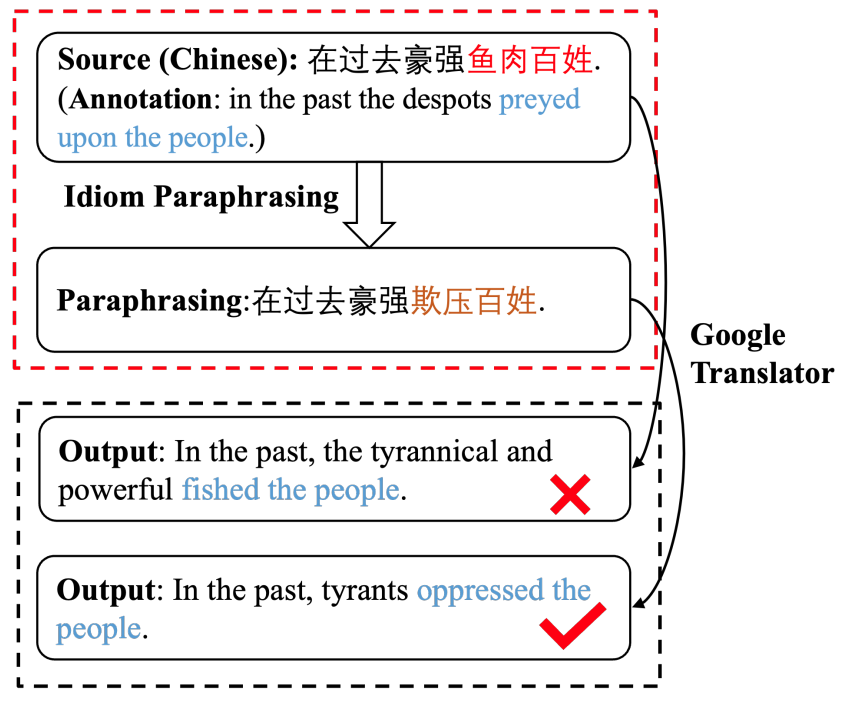

## Chinese Idiom Paraphrasing

Chinese Idiom Paraphrasing (CIP), which goal is to rephrase the idioms of input sentence to generate a fluent, meaning-preserving sentence without any idiom:



Data in this [dataset](./data) and several approaches: 

- LSTM approach

- Transformer approach

- mt5 approach

- infill approach

### Dependecies

- Python>=3.6
- torch>=1.7.1
- transformers==4.8.0
- fairseq==0.10.2

### Pre-trained model

you can download all pre-trained models [here](https://pan.baidu.com/s/1zYffBCf7zAFXNhBraJXqOw?pwd=4s9n)(4s9n), and put it into```model```directory.

If you want train models from scratch, you need uses the pre-trained language models t5-pegasus ([ZhuiyiTechnology](https://github.com/ZhuiyiTechnology/t5-pegasus)) and place the models under the ```model``` directory after downloading.

### Train

train LSTM and Transformer model by fairseq, you need process data for jieba and bpe tokenize sentence, we use scripts from Subword-nmt:

```shell
git clone https://github.com/rsennrich/subword-nmt
```

Then run
```shell
sh prepare.sh
```

train LSTM, Transformer, t5-pegasus, infill  model

```shell
sh train_lstm.sh
sh train_transformer.sh
sh train_t5_pegasus.sh
sh train_infill.sh
```

### Generate

Run the following command to generate
```shell
sh fairseq_generate.sh
sh generate_t5_pegasus.sh
sh generate_infill.sh
```

## Citation

```
@article{qiang2022chinese,
  title={Chinese Idiom Paraphrasing},
  author={Qiang, Jipeng and Li, Yang and Zhang, Chaowei and Li, Yun and Yuan, Yunhao and Zhu, Yi and Wu, Xindong},
  journal={arXiv preprint arXiv:2204.07555},
  year={2022}
}
```
